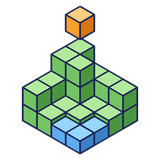

<p align="center">
  
</p>

<h1 align="center">Terrain Generator</h1>

<p align="center">
  Minecraft-style terrain for BlockDesigner: pick a generator, type a seed, tune it while a map redraws,<br>
  and bake a region into a new layer of ordinary, editable blocks.
</p>

<p align="center">
  <a href="https://github.com/doolecg/BlockDesigner-TerrainGenerator/releases/latest"></a>
  <a href="https://github.com/doolecg/BlockDesigner-TerrainGenerator/releases"></a>
  <a href="LICENSE"></a>
  
  <a href="https://github.com/doolecg/BlockDesigner"></a>
</p>

---

Terrain Generator is a plugin for [BlockDesigner](https://github.com/doolecg/BlockDesigner), the Windows editor for Minecraft builds. It is released
on its own, separately from the app. It needs **BlockDesigner 0.4.17 or later** (plugin API 3).

**Contents:** [Download](#download-and-install) · [Features](#features) · [Building from source](#building-from-source) · [Project layout](#project-layout)

## Download and install

Get the latest version from the [releases page](https://github.com/doolecg/BlockDesigner-TerrainGenerator/releases/latest):

1. Download `terrain-generator-<version>.jar`.
2. In BlockDesigner open **Plugins (puzzle icon) › Manage plugins… › Install…** and pick the jar.

It is on straight away, as the **Terrain Generator** tab on the right; its **Terrain** page is where you work. You can switch it off, reload or
uninstall it in the same window, and it **updates itself** (Plugins › Manage plugins… › Update plugins automatically). Plugins run with the same
access as BlockDesigner itself, so only install ones you trust.

## Features

### Making terrain

1. **Pick a generator** (Vanilla-like, Islands, Mesas or Rolling hills), or **Open…** a `.tgen.json` file.
2. **Type a seed**, a number or any text (text is hashed the way Minecraft hashes it), or roll one with the dice.
3. **Tune the sliders** under Shape. The map redraws as you go, in the panel and lying on the ground in the 3D view,
   with the bake region drawn as a box and its chunks marked.
4. **Set the region:** click the map to centre it there (the wheel zooms), type its centre and size, **Use
   selection**, or drag it out in the view with the **Terrain region** tool (a click moves it; the wheel while dragging
   sets how deep it goes). **Down to Y** sets how deep to bake: the world goes down to −64, and most of that is plain
   stone.
5. **Voxels** (optional): bake at 2, 4 or 8 blocks per voxel, either expanded to full size (blocky terrain) or as a
   small model with one block per voxel.
6. **Bake to new layer.** The region becomes a new layer of normal blocks in one undo step. Build on it, edit it or
   export it like anything else.

### Saved with the project

Everything you set is kept in the project as the **Terrain preview** (in the Layers panel, badge TERRAIN): it is saved
with the project, every change can be undone, and hiding it hides the map and the region box in the view. Right-click
it to bake or roll a new seed. **Save…** writes the generator with your slider settings as a `.tgen.json` file.

### Commands

From the command line (T or /):

| Command | What it does |
|---|---|
| `/terrain seed <number or text>` | Sets the seed (a random one without a value) |
| `/terrain preset <id>` | Picks a generator: `vanilla-like`, `islands`, `mesas`, `rolling-hills` |
| `/terrain region <x> <z> <width> [depth]` | Sets the region; `/terrain region` alone takes the //pos1 //pos2 region |
| `/terrain bake [width] [depth]` | Bakes the region (resized first when sizes are given) |

### Generators

A generator is a small graph of noise nodes (Perlin, simplex, value and Worley noise, fractal layering, domain
warp, curves, terraces and maths) with surface rules (grass on top, dirt below, sand at the shore, and so on) and
scatter (trees and boulders). The same seed always gives the same blocks, on any machine and in any order. The
format is plain JSON; see [docs/plan.md](docs/plan.md) for where this is going (a live 3D preview, a node editor and
exact vanilla terrain from your own Minecraft).

| Generator | What it makes |
|---|---|
| **Vanilla-like** | Continents and oceans, eroded plains, ridged mountains with snowy peaks, overhangs, beaches, oak and birch trees. It looks like Minecraft but is not a copy of a real seed. |
| **Islands** | Wavy islands in a wide sea, with beaches, rocky cliffs, trees and boulders. |
| **Mesas** | Stepped badlands plateaus with banded terracotta cliffs over red sand. |
| **Rolling hills** | Flat land with gentle hills. The simplest place to start. |

## Building from source

You need Windows and a JDK 26 (Temurin 26 is what BlockDesigner uses; set `org.gradle.java.home` in
`gradle.properties` to yours). Then:

```
./gradlew jar      # build/libs/terrain-generator-<version>.jar
```

The plugin compiles against the BlockDesigner plugin API jars in [`libs/`](libs) (from BlockDesigner 0.4.18). The app
provides them, and JavaFX, at runtime, so they are never bundled into the plugin. To target a newer API, replace them
with the jars from a newer BlockDesigner build (`./gradlew :plugin-api:jar :core:jar` in the
[BlockDesigner repository](https://github.com/doolecg/BlockDesigner)) and update the file names in `plugin/build.gradle.kts`.

The version is set in `build.gradle.kts` and copied into the jar's `blockdesigner-plugin.json`. To release a new
version, change it there, add a section to [RELEASE_NOTES.md](RELEASE_NOTES.md), build the jar and attach it to a
GitHub release tagged with the version.

For writing plugins, see BlockDesigner's [plugin guide](https://github.com/doolecg/BlockDesigner/blob/main/PLUGINS.md) and
[API reference](https://github.com/doolecg/BlockDesigner/blob/main/docs/plugin-api-reference.md).

### Tests

```
./gradlew check
```

Runs every test, including the determinism tests a second time with `-Xint`, so the same seed is checked to give the same blocks.

## Project layout

| Path | What it does |
|---|---|
| `runtime/` | The generator: noises, the node graph and its JSON format, the compiler, the chunk filler, surface rules, scatter and the built-in presets. Plain Java 17 with no dependencies. |
| `plugin/` | The BlockDesigner plugin: the Terrain panel, the Terrain preview object, the region tool, the `/terrain` command, the map and baking. The runtime is built into its jar. |
| `libs/` | The BlockDesigner plugin API jars it compiles against |
| `docs/plan.md` | The design plan and its phases |

## License

[MIT](LICENSE)
